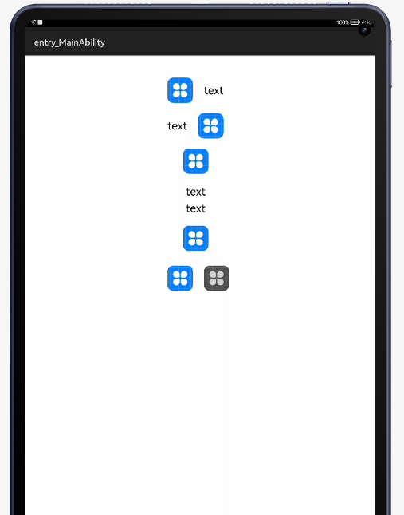

# TextWithImageDrawable

A HMOS library to draw an element with an image and text to a single image (TextWithImageDrawable) or combine two images to a single image (BaseCombinedDrawable)

# Source
Inspired by [wuseal/TextWithImageDrawable](https://github.com/wuseal/TextWithImageDrawable) - version 1.0.4

## Features
This library provides options to create an element with image and text combined or combine two images in a single element as shown in screen below



## Dependency
1. For using textwithdrawable module in sample app, include the source code and add the below dependencies in entry/build.gradle to generate hap/support.har.
```groovy
    dependencies {
    implementation fileTree(dir: 'libs', include: ['*.jar', '*.har'])
    implementation project(path: ':textwithdrawable'
)
    testImplementation 'junit:junit:4.13'
    ohosTestImplementation 'com.huawei.ohos.testkit:runner:1.0.0.100'
}
```
2. For using textwithdrawable in separate application using har file, add the har file in the entry/libs folder and add the dependencies in entry/build.gradle file.
```groovy
    dependencies {
    implementation fileTree(dir: 'libs', include: ['*.har'])
    testImplementation 'junit:junit:4.13'
}
```
## Usage

Following API are provided,

```groovy
            /**
             * Instantiate an element that contains both text and image 
			 */ 
            TextWithImageDrawable textWithImageDrawable = new TextWithImageDrawable(this);
            /**              
			 * Set the text for the element
			 */ 
            textWithImageDrawable.setText(text);
            /**              
			 * Set the Image resource for the element
			 */ 
            textWithImageDrawable.setImageRes(ResourceTable.Media_icon);
             /**
             * Set the Image pixel map for the element
             */
            textWithImageDrawable.setImageBitmap(mBitmap);
            /**
             * Set the size for text in the element
             */
            textWithImageDrawable.setTextSize(16);
            /**
             * Set color for the text in the element
             */
            textWithImageDrawable.setTextColor(Color.GREEN.getValue());
            /**
             * Set padding for the image in pixels
             */
            textWithImageDrawable.setImagePadding(10);
            /**
             * Set the left padding for the image in pixels
             */
            textWithImageDrawable.setPaddingLeft(10);

```	

Sample usage

```groovy
    private String mText = "text";

    @Override
    public void onStart(Intent intent) {
        super.onStart(intent);
        super.setUIContent(ResourceTable.Layout_ability_main);
		
	    TextWithImageDrawable drawLeft = new TextWithImageDrawable(this);
        initDrawable(drawablePadding, drawLeft, mText, TextWithImageDrawable.Position.LEFT);
        Image imgTxtLeft = (Image) findComponentById(ResourceTable.Id_leftImage);
        imgTxtLeft.addDrawTask(new Component.DrawTask() {
            @Override
            public void onDraw(Component component, Canvas canvas) {
                drawLeft.drawToCanvas(canvas);
            }
        });
        imgTxtLeft.invalidate();

        TextWithImageDrawable drawRight = new TextWithImageDrawable(this);
        initDrawable(drawablePadding, drawRight, mText, TextWithImageDrawable.Position.RIGHT);
        Image imgTxtRight = (Image) findComponentById(ResourceTable.Id_rightImage);
        imgTxtRight.addDrawTask(new Component.DrawTask() {
            @Override
            public void onDraw(Component component, Canvas canvas) {
                drawRight.drawToCanvas(canvas);
            }
        });
        imgTxtRight.invalidate();

        TextWithImageDrawable drawTop = new TextWithImageDrawable(this);
        initDrawable(drawablePadding, drawTop, mText, TextWithImageDrawable.Position.TOP);
        Image imgTxtTop = (Image) findComponentById(ResourceTable.Id_topImage);
        imgTxtTop.addDrawTask(new Component.DrawTask() {
            @Override
            public void onDraw(Component component, Canvas canvas) {
                drawTop.drawToCanvas(canvas);
            }
        });
        imgTxtTop.invalidate();

        TextWithImageDrawable drawBottom = new TextWithImageDrawable(this);
        initDrawable(drawablePadding, drawBottom, mText, TextWithImageDrawable.Position.BOTTOM);
        Image imgTxtBottom = (Image) findComponentById(ResourceTable.Id_bottomImage);
        imgTxtBottom.addDrawTask(new Component.DrawTask() {
            @Override
            public void onDraw(Component component, Canvas canvas) {
                drawBottom.drawToCanvas(canvas);
            }
        });
        imgTxtBottom.invalidate();
    }

    private void initDrawable(int drawablePadding, TextWithImageDrawable drawable, String text,
                              TextWithImageDrawable.Position position) {
        drawable.setText(text);
        drawable.setImagePosition(position);
        drawable.setImagePadding(drawablePadding);
        drawable.setImageRes(ResourceTable.Media_icon);
    }
```

## BaseCombinedDrawable

A combined drawable can piece together two images and combine them into a new element.
The positions of the two images can be flexibly combined, which can basically meet the customization of all images, and a variety of graphics .

API

```groovy
    /**
     * Set the relative offset position of the upper left corner of drawable two relative to the upper left corner of
     * drawable one.
     *
     * @param relatedX relative offset of x-axis
     * @param relatedY relative offset of y-axis
     */
	 public void setRelatedPosition( int relatedX, int relatedY)     
      
    /**
     * Method to set padding on four sides.
     *
     * @param paddingLeft   Left padding
     * @param paddingTop    Top padding
     * @param paddingRight  Right padding
     * @param paddingBottom Bottom padding
     */
	 public void setPadding ( int paddingLeft, int paddingTop, int paddingRight, int paddingBottom)
```

Sample code

```groovy
	    BaseCombinedDrawable baseCombinedDrawable = new BaseCombinedDrawable(drawableLeft, drawableRight);
        baseCombinedDrawable.setRelatedPosition(drawableLeft.getWidth() + drawablePadding, 0);
        Image combinedImg = (Image) findComponentById(ResourceTable.Id_combinedImage);
        combinedImg.addDrawTask(new Component.DrawTask() {
            @Override
            public void onDraw(Component component, Canvas canvas) {
                baseCombinedDrawable.drawToCanvas(canvas);
            }
        });
        combinedImg.invalidate();
```

## Future work

Since there is no alternate api for setColorFilter and getOpacity in HMOS platform, so those functions is currently not supported. 
This library draws the image and text directly on the provided canvas, so we cannot use TextWithImageDrawable as an input to BaseCombinedDrawable and width and height of the image should be managed properly